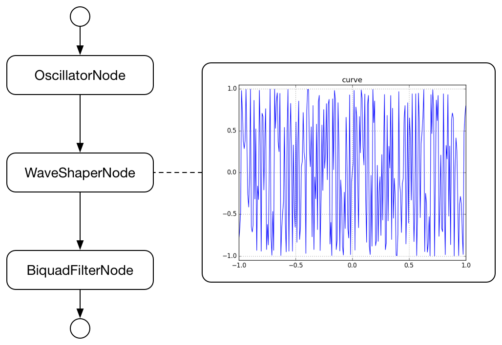

# PluckStringNode
[](https://travis-ci.org/mohayonao/pluck-string-node)
[](https://www.npmjs.org/package/pluck-string-node)
[](https://mohayonao.mit-license.org/)

> Pluck String AudioNode for Web Audio API

## Installation

```
npm install pluck-string-node
```

#### downloads:

- [pluck-string-node.js](https://raw.githubusercontent.com/mohayonao/pluck-string-node/master/build/pluck-string-node.js)
- [pluck-string-node.min.js](https://raw.githubusercontent.com/mohayonao/pluck-string-node/master/build/pluck-string-node.min.js)

## API
### PluckStringNode
- `constructor(audioContext, opts)`
  - `audioContext: BaseAudioContext`
  - `opts.color: number` tone color (aka cutoff frequency)
  - `opts.timeConstant: number` time constant until harmonics converges

#### Instance Attributes
- `frequency: AudioParam` _readonly_
- `detune: AudioParam` _readonly_
- `color: number`
- `timeConstant: number`

#### Instance Methods
- `start(when: number): void`
- `stop(when: number): void`

## Quick Example

```js
var pluck = new PluckStringNode(audioContext);

pluck.color = 1000;
pluck.timeConstant = 10;
pluck.frequency.value = 880;
pluck.start(audioContext.currentTime);
pluck.stop(audioContext.currentTime + 4);
```

## Demo

https://mohayonao.github.io/pluck-string-node/

## Algorithm
This node's algorithm is inspired from [Karplus–Strong string synthesis](https://en.wikipedia.org/wiki/Karplus%E2%80%93Strong_string_synthesis).

1. create OscillatorNode
2. OscillatorNode connect to WaveShaperNode which has random curve
3. WaveShaperNode connect to lowpass BiquadFilterNode
4. when `start()`, set `color` to the BiquadFilterNode frequency
5. and the cutoff frequency continuous change to very low frequency during `timeConstant`.

## AudioGraph



## License

MIT
