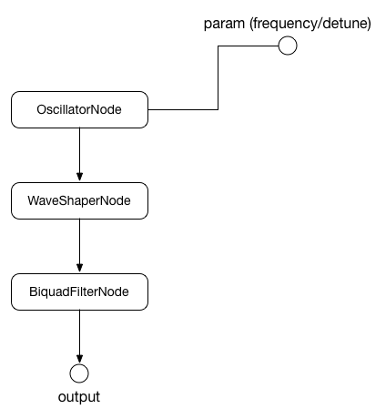

# PluckNode
[](https://travis-ci.org/mohayonao/pluck-node)
[](https://www.npmjs.org/package/pluck-node)
[](http://mohayonao.mit-license.org/)

> Pluck String AudioNode for Web Audio API

## Installation

```
npm install pluck-node
```

downloads:

- [pluck-node.js](https://raw.githubusercontent.com/mohayonao/pluck-node/master/build/pluck-node.js)
- [pluck-node.min.js](https://raw.githubusercontent.com/mohayonao/pluck-node/master/build/pluck-node.min.js)

## API
### PluckNode
- `constructor(audioContext, [color, decayTime])`
  - `color: number` cutoff frequency (aka tone color)
  - `decayTime: number` time until harmonics converges

#### Class Methods
- `install(): void`
  - install `createPluck()` method to `AudioContext.prototype` force

#### Instance Attributes
- `frequency: AudioParam` _readonly_
- `detune: AudioParam` _readonly_

#### Instance Methods
- `start(when: number): void`
- `stop(when: number): void`

## Usage

```js
var pluck = new PluckNode(audioContext, 1000, 10);

pluck.frequency.value = 880;
pluck.start(audioContext.currentTime);
pluck.stop(audioContext.currentTime + 4);
```

### Install to AudioContext

At first, call `install()` method.

```js
require("pluck-node").install();
```

```html
<script src="/path/to/pluck-node.js"></script>
<script>PluckNode.install();</script>
```

Then, you can use `createPluck(color, decayTime)` method at AudioContext.

## Demo

http://mohayonao.github.io/pluck-node/

## Algorithm
This algorithm is inspired from [Karplus–Strong string synthesis](https://en.wikipedia.org/wiki/Karplus%E2%80%93Strong_string_synthesis).

1. create OscillatorNode
2. OscillatorNode connect to WaveShaperNode which has random curve
3. WaveShaperNode connect to lowpass BiquadFilterNode
4. when `start()`, set `color` to the BiquadFilterNode frequency
5. and the cutoff frequency continuous change to very low frequency during `decayTime`.

## AudioGraph



## License

MIT
